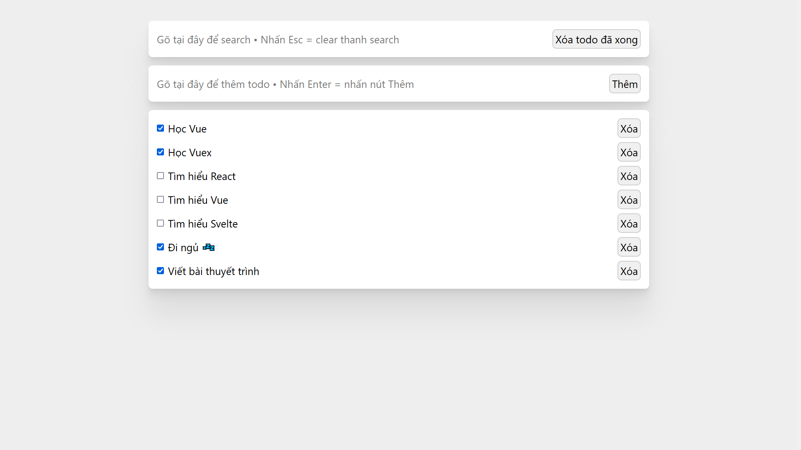

#  Simple Vue Todo App

Đây là một cái app todo kinh điển "dành cho người mới bắt đầu" được viết bằng Vue.




## Điểm nổi bật

*   Viết bằng Vue 3 (nhưng không dùng Composition API) và Vuex (quản lý state)
*   Được bootstrap bằng [Vite](https://vitejs.dev/), một trình build + dev server nhanh gọn hơn (nhưng ít tính năng hơn :<) so với Vue CLI


### Điểm không nổi bật lắm

*   Đảm bảo 0% Clean Code (cả project này được viết tay mà không có sự trợ giúp của `eslint + prettier` .\_.)
*   `global.css` – không tận dụng Scoped Style của Vue .\_.
*   Có dùng một chút [`lodash-es`](https://yarnpkg.com/package/lodash-es) (để đỡ phải làm tà đạo với object/array hơn)
*   Favicon cung cấp bởi Icons8 – ["Microsoft Todo 2019 icon in Fluency Style"](https://icons8.com/icon/HpPqCqynotVp/microsoft-todo-2019)


### Bắt đầu

```bash
yarn

# Chạy local dev server
yarn dev

# Build để deploy
yarn build

# Serve bản đã build trên local server
yarn serve
```


>   help what am i even doing rn

